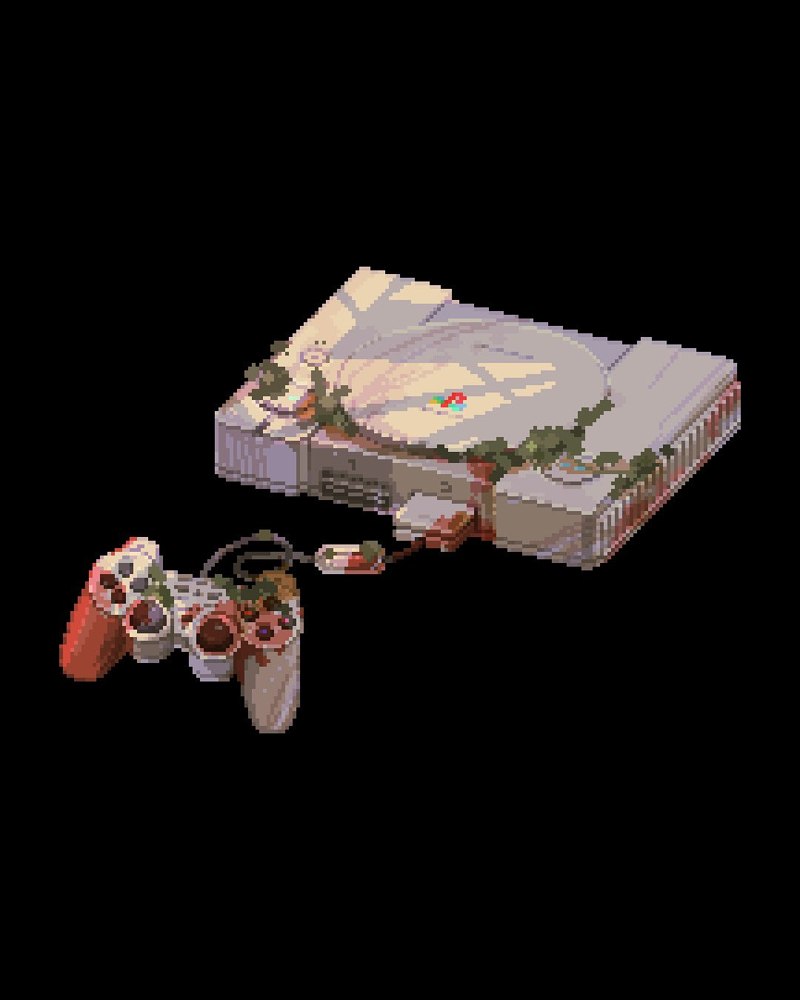
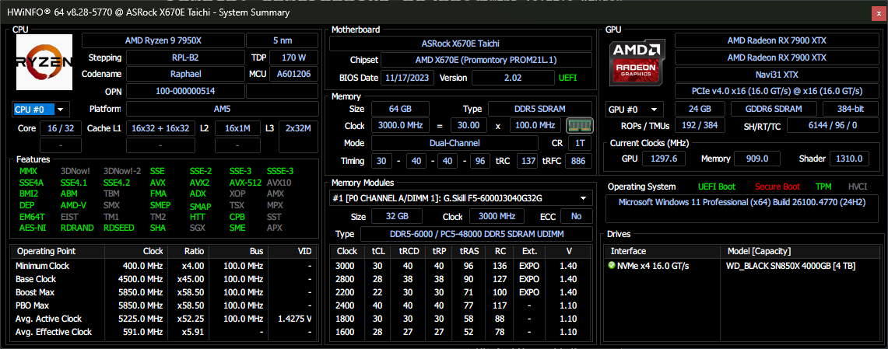
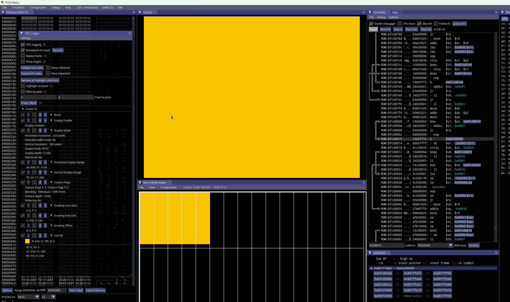
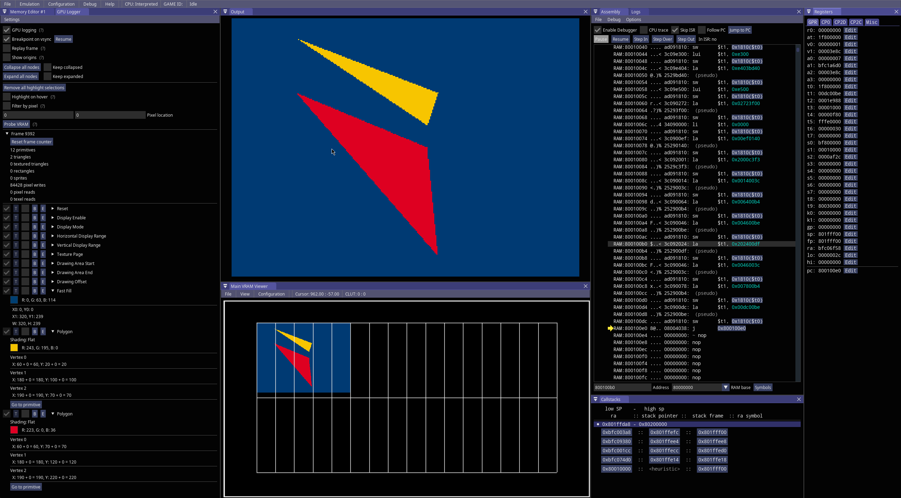
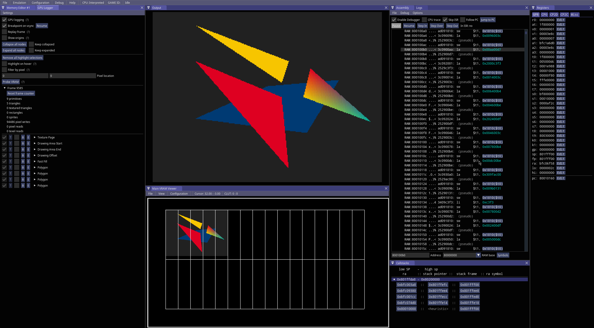

# Pikuma PS1

A rest from the usual.



## Dependencies

I will be programming from a Windows 11 machine:


```ps1
# not really used yet for scripts (may never)
scoop install lua
```

[armips](https://github.com/Kingcom/armips)

* Supports doing bare-metal assembly for the ps1
* `scoop install armips` or just clone and build..

[pscx-redux](https://github.com/grumpycoders/pcsx-redux/): A collection of tools, research, hardware design, and libraries aiming at development and reverse engineering on the PlayStation 1.

* Used as the runtime sandbox emulated the ps1
* Has hookups to behaving as a gdb server which can be utilized with the gdb client in vscode.
* Supports symbolic info emitted by armips
* pysq library has been sucessfully adjusted for modern compiler usage (see: `src/`)

[MIPS Toolchain (from pscx-redux)](https://static.grumpycoder.net/pixel/mips/)

* Used for building ps1 programs for the C runtime provided by the psyq/o SDK

[nugget](https://github.com/pcsx-redux/nugget)

* Readonly mirror of pcsx-redux's `src/mips` directory.
* Not necessary if the pcsx-redux repo is cloned

[PSX Psy-Q SDK (supplied by `psx.arthus.net`)](https://psx.arthus.net/sdk/Psy-Q/)

* Original official SDK
* Modernized using obj parser to extract info for GNU toolchain usage.
* Can either grab from arthus [psyq-4.7-converted-full.7z](https://psx.arthus.net/sdk/Psy-Q/psyq-4.7-converted-full.7z) or [psyq-4_7-converted-light.zip](psyq-4_7-converted-light.zip)
  * The light version omits the link modules (object files), just keeps the static archives.
* Can be utilized effectively with the includes below

[psyq_include_what_you_use](https://github.com/johnbaumann/psyq_include_what_you_use/)

* Fixes psyq headers to include what they use, so changing the include order in your project doesn't break compiling.
* Needed if you want to link and utilize the psyq C SDK

## Gallery

  
  
  
